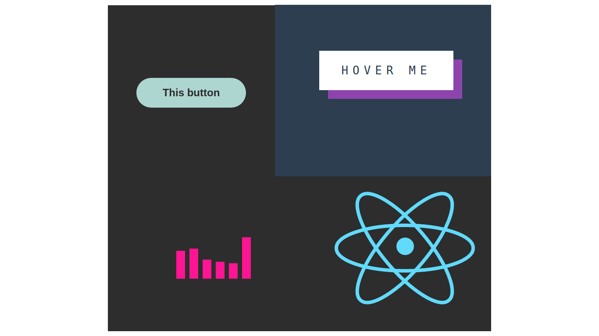

Simple examples of CSS3
==========
### Library of CSS effect based on animation, transition and transformation

************
Everything that you need to do, its clone this repository, open root folder and watch all examples.

For use this, you should make:
+ 'git clone *this repository*'
+ npm i
+ bower i

>all example, require old version of browser (i advise use Chrome), because in some example use such properties: *cros-fade()*, *object-fitt*, *object-position*.

*Copyright (c) 2017 Andrew Kiri4encko*

THE SOFTWARE IS PROVIDED "AS IS", WITHOUT WARRANTY OF ANY KIND, EXPRESS OR IMPLIED, INCLUDING BUT NOT LIMITED TO THE WARRANTIES OF MERCHANTABILITY, FITNESS FOR A PARTICULAR PURPOSE AND NONINFRINGEMENT. IN NO EVENT SHALL THE AUTHORS OR COPYRIGHT HOLDERS BE LIABLE FOR ANY CLAIM, DAMAGES OR OTHER LIABILITY, WHETHER IN AN ACTION OF CONTRACT, TORT OR OTHERWISE, ARISING FROM, OUT OF OR IN CONNECTION WITH THE SOFTWARE OR THE USE OR OTHER DEALINGS IN THE SOFTWARE.s:

The above copyright notice and this permission notice shall be included in all copies or substantial portions of the Software.